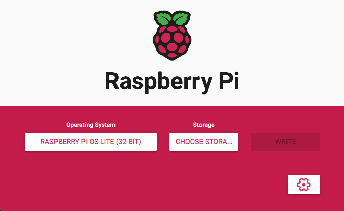
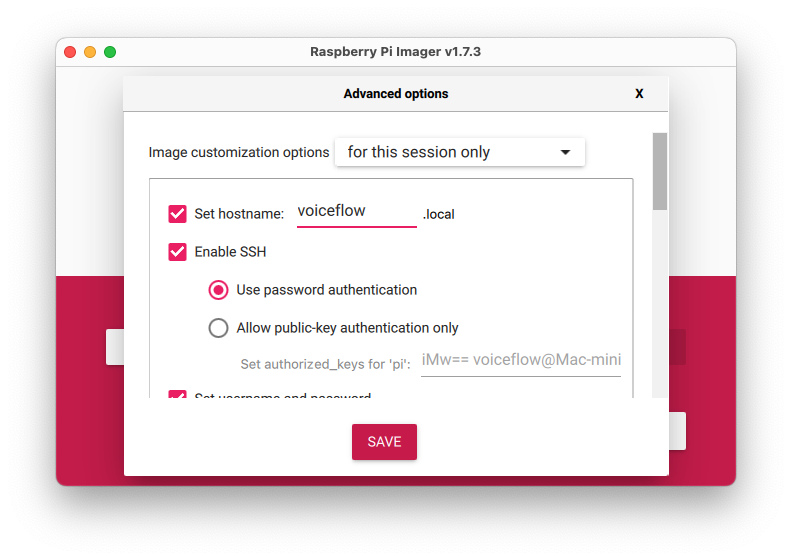
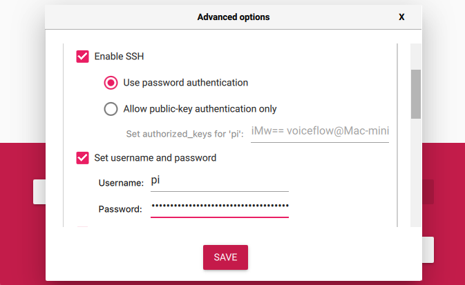

# RaspberryPI | Node | DM API

## Setup

### Create the image and burn it on a SD card

Create a new image of Raspberry PI OS Lite (**32-bit**) with Raspberry Pi Imager


Set the hostname
Note: In this doc, the hostname will be **voiceflow**


Enable SSH and configure your username/Password and Wifi if you want to use it
Note: In this doc, the username will be **pi**



### SSH into the Raspberry PI

Power on the Raspberry PI and on your computer, **open a terminal**.
You want to remotely access your Raspberry over SSH with the credentials you’ve set previously.

```
ssh pi@voiceflow.local
```

Note: If you want, you can add your authorized_keys files the .ssh directory on the Raspberry PI to avoid typing your password every time you want to connect to it.

### Change password
If you want to change the password previously set:
```
sudo passwd pi
```

### raspi-config
```
sudo raspi-config
```
expand the partition
set graphic memory to 16
reboot

### Update the system and install Git CLI
```
sudo apt-get update && sudo apt-get upgrade -y
sudo apt-get install -y git
```

### Install NodeJS
```
sudo su
curl -fsSL https://deb.nodesource.com/setup_18.x | bash -
sudo apt-get install -y nodejs
su pi
```

Check the install with:
```
node --version
npm --version
```

### Clone the repo
```
git clone https://github.com/voiceflow-gallagan/voiceflow-raspi-node.git
```

### Install RaspiAudio Card drivers (only for RaspiAudio HAT)
```
wget -O - mic.raspiaudio.com | bash
```
Reboot the Raspberry PI

Use the following command to check if the card is detected:
```
wget -O - test.raspiaudio.com | bash
```

### Install PM2 to autostart the app
```
npm install pm2@latest -g
```

Config PM2 to start on boot
```
pm2 startup
```

### Install python3-pip
```
sudo apt install python3-pip
```

### MPG321 | Speaker
```
sudo apt-get install mpg321
sudo apt-get install libasound2-dev
```

### Install the app packages
```
cd voiceflow-raspi-node
npm install
```

### Edit .bashrc
```
sudo nano .bashrc
```
Add the following line at the end of the file:
```
cd voiceflow-raspi-node
```

### Create the .env file at the root of the project
```
PROCUPINE_ACCESS_KEY = "YOUR_ACCESS_KEY"
VF_API_KEY="VF.DM.XYZ"
VF_VERSION_ID="development"
TUNNEL_SUBDOMAIN="vfassistant"
PORT=3978
```
**PROCUPINE_ACCESS_KEY**: Get your access key from [Picovoice Console](https://picovoice.ai/console/)
**VF_API_KEY**: Get your project API key from [Voiceflow Creator](https://developer.voiceflow.com/reference/project)
**TUNNEL_SUBDOMAIN**: The subdomain you want to use for your tunnel.

### Start the app
At the **root of the project**, run:
```
npm start
```
On first start, the PM2 list will be updated.
You can check the **PM2 list** with:
```
pm2 l
```
As **PM2 start on boot**, if you reboot the Raspberry PI the app will autostart and listen for the wakeword.

## More info
You can create your own **Wakeword** model with [Picovoice Console](https://picovoice.ai/console/)
and change the path in the **wakeword.js** file

```
let keywordPaths = 'wakeword/Hey-Voice-flow_en_raspberry-pi_v2_1_0.ppn' // program["keyword_file_paths"];
```


You can use/download another **Vosk** model from here: https://alphacephei.com/vosk/models

**Localtunnel** is used to create a tunnel to your local machine. You can change the subdomain in the .env file.
This is useful if you want to send an event to your local machine from the outside using the **/api/messages** endpoint.
When starting the app, you will see your **tunnel url** in the console.

```
/api/messages?event=hello
```
